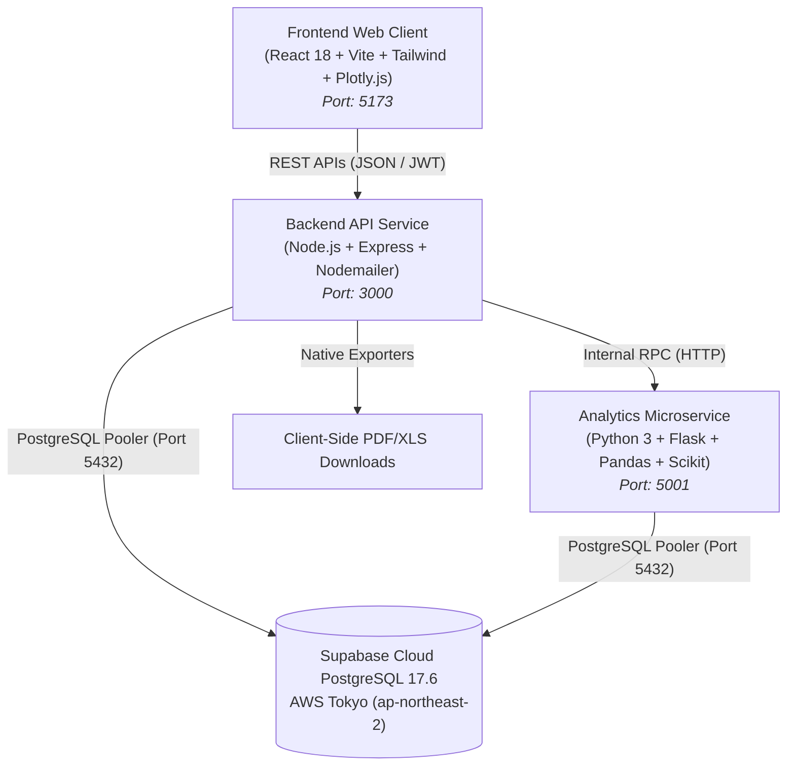

# 🏛️ Central Public Procurement Intelligence Platform

[](https://github.com/)
[](https://github.com/)
[](https://github.com/)
[](https://github.com/)
[](https://supabase.com/)

A web-based government procurement oversight platform built by a team of 6 engineers and domain specialists to assist tender evaluation committees, vigilance officers, and public procurement desks in scrutinizing commercial contractor bids, tracking behavioral anomalies, and generating decision-support dossiers.

---

## 👥 Platform Team & Module Ownership

| Role | Module Ownership | Key Responsibilities |
| :--- | :--- | :--- |
| **Lead Systems Architect** | Core Infrastructure & Database | Supabase IPv4 Session Pooler, microservice IPC, connection pooling, and schema design |
| **Senior Backend Engineer** | API Services & Security | Express REST endpoints, JWT session auth, RBAC middleware, and GFR 2017 rules |
| **Lead Analytics Engineer** | Behavioral Analytics Engine | Python analytics service, 5-point risk models, delay scoring, and cartel heuristics |
| **Frontend UI/UX Engineer** | Web Client & Dashboards | React 18, Tailwind CSS, Plotly multi-axis radar charts, and responsive UI |
| **Procurement Domain Specialist** | Tender & BOQ Standards | CPPP notice briefs, Pre-Bid meeting workflows, and MoRTH schedule schemas |
| **DevOps & QA Engineer** | File Exporters & Test Pipelines | Native client-side PDF/XLS generators, bulk data ingestion, and regression tests |

---

## 🌟 Core System Capabilities

### 1. ⚖️ 5-Point Behavioral Risk Framework (10.0 Points Each)
The platform evaluates every competing contractor across 5 independent behavioral dimensions, each scored out of **10.0 points** (Total base composite risk: **50.0 points** / Normalized: **100 points**):
- **Point 01: Past Delivery & Schedule Delay Record (10.0 pts)**: Tracks historical project completion records, time overruns, and milestone slippage.
- **Point 02: Price Deviation & Rate Aggression Index (10.0 pts)**: Detects predatory or unbalanced unit pricing against standard schedule of rates (SoR).
- **Point 03: Anti-Collusion & Bidding Anomaly (10.0 pts)**: Scrutinizes submission timestamp bursts, geographic IP coordinates, and bid rotation patterns.
- **Point 04: Financial Solvency & Working Capital (10.0 pts)**: Evaluates bank solvency certificates, balance sheet liquidity, and capital depth.
- **Point 05: Technical Quality & Audit Compliance (10.0 pts)**: Assesses star engineering ratings, safety certifications, and certified laboratory testing.

### 2. 📅 Pre-Bid Conference & Clarification Coordinates
- Pre-Bid Meeting schedules with exact dates, timings, physical venue, and official NIC WebEx Video Conference coordinates.
- Clarification query deadlines, nodal officer contacts, and published Minutes of Meeting (MoM).

### 3. 📑 Top 5 Bidder Merit Dossiers
- Ranks top 5 bidders, guaranteeing the **Recommended Most Deserving Contractor** remains at **`🏆 #1`**.
- Multi-parameter evaluation matrix summarizing schedule adherence, rate safety, and technical ratings.

### 4. 📥 Native Local Storage File Downloads (PDF / XLS)
- Native client-side file exporter saves formatted documents directly into your local **`Downloads/`** folder:
  - **Tender Evaluation Merit Dossier** (`.pdf` / `.html`)
  - **Top 5 Bidder Comparison Matrix** (`.xlsx` / `.csv`)
  - **Contractor Audit Profile & Execution History** (`.pdf` / `.xlsx`)
  - **Bill of Quantities (BOQ) Price Bid Schedule** (`.xlsx`)

### 5. 📂 Data Center Bulk Dataset Ingestion
- Upload `.xlsx`, `.xls`, `.csv`, `.json`, or `.pdf` files to automatically train 5-parameter behavioral models and persist all extracted tenders, contractors, bids, and risk scorecards directly to PostgreSQL.

### 6. ✉️ Nodemailer Email Verification
- Integrated Nodemailer service for single-step officer account activation via 6-digit Email OTP.
- Supports direct Gmail configuration (`service: 'gmail'`) as well as custom SMTP servers.

---

## 🏗️ System Architecture



---

## 🚀 Local Development Setup

### Prerequisites
- **Node.js** v18+ or v20+ LTS
- **Python** 3.10+ or 3.11+
- **PostgreSQL / Supabase** database instance

---


#### 1. Backend Service (Port 3000)
```bash
cd backend
npm install
npm start
```

#### 2. Python Analytics Engine (Port 5001)
```bash
cd analytics
pip install -r requirements.txt
python app.py
```

#### 3. Frontend Web Client (Port 5173)
```bash
cd frontend
npm install
npm run dev
```

Open **http://localhost:5173** in your browser.

---

## 🔐 Demo Credentials

| Role | Identifier / Username | Password | Clearance Level |
| :--- | :--- | :--- | :--- |
| **Super Administrator** | `admin` | `Admin@123` | Full administrative, ingestion & system management |
| **Procurement Officer** | `officer_sharma` | `Officer@123` | Tender evaluation, risk analysis & report export |

---

## 📡 Key REST API Endpoints

### Authentication & Officer Security
- `POST /api/auth/signup` — Register officer profile and trigger Nodemailer OTP
- `POST /api/auth/verify-email-otp` — Verify 6-digit email OTP and activate officer account
- `POST /api/auth/login` — Authenticate officer and receive JWT bearer token
- `GET /api/auth/me` — Retrieve active officer profile and security clearance

### Tenders & Contractor Intelligence
- `GET /api/tenders` — Fetch catalog of public procurement tenders
- `GET /api/tenders/:id` — Retrieve CPPP brief, pre-bid meeting schedule, bids, and BOQ
- `GET /api/contractors` — Fetch commercial contractor directory
- `GET /api/contractors/:id` — Retrieve 5-point risk scorecards and execution history
- `GET /api/risk/evaluate/:tenderId` — Execute 5-parameter behavioral analysis across bidders

### Data Ingestion & Model Training
- `POST /api/ingestion/upload` — Ingest `.xlsx`, `.csv`, `.json`, or `.pdf` datasets, auto-train behavioral models, and persist records to PostgreSQL

---

## 📜 Sprints & Engineering Changelog

- **Sprint 8 (`v2.4.2-prod`)**: Nodemailer email integration, single-step Email OTP verification, top 5 bidder ranking with #1 merit preservation, native client-side PDF/XLS local storage exporters.
- **Sprint 7 (`v2.4.1`)**: 10.0-point scale on all 5 separate behavioral parameters across radar charts and profile views.
- **Sprint 6 (`v2.3.0`)**: Supabase IPv4 Session Pooler connection with SSL encryption.
- **Sprint 5 (`v2.2.0`)**: Pre-Bid meeting schedule integration and CPPP NIT brief parser.
- **Sprint 4 (`v2.1.0`)**: Automated data ingestion with PostgreSQL persistence for tenders, bidders, and scorecards.
- **Sprint 3 (`v2.0.0`)**: Multi-bidder radar overlay matrix and scorecards.
- **Sprint 2 (`v1.5.0`)**: JWT auth, 2FA OTP verification, GFR 2017 rule engine.
- **Sprint 1 (`v1.0.0`)**: Project bootstrap, database schemas, and baseline service setup.

---

## ⚖️ Standards & Compliance

Adheres to **General Financial Rules (GFR 2017)**, **Central Vigilance Commission (CVC)** public procurement guidelines, and **Ministry of Road Transport & Highways (MoRTH)** standard data specifications.
